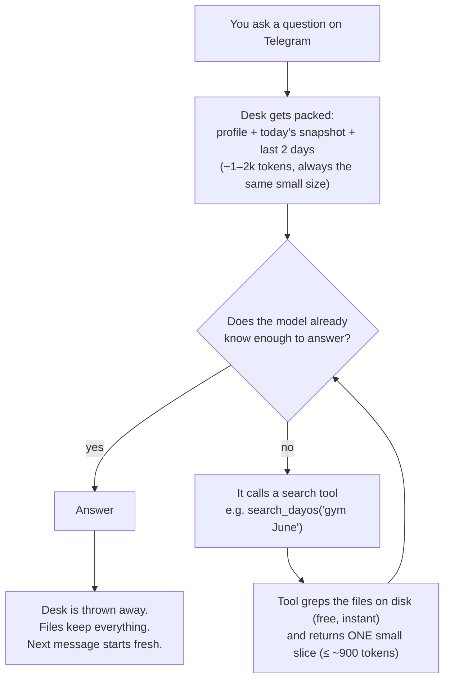

# How the second brain actually works (plain-language explainer)

*Written 2026-07-16 for the founder. No jargon where avoidable. The technical
plan of record stays `docs/SECOND_BRAIN.md`; this doc answers one question:
how can the brain hold years of data when the model can only "think about"
a small amount at once?*

## The one-sentence answer

**The model never carries the library around — it walks into the library,
grabs the one page it needs for *this* question, answers, and puts it back.**

The huge memory lives in plain files on the server (unlimited, free to store).
The model's context window (its "working desk") only ever holds a tiny,
hand-picked slice of it — rebuilt fresh for every single message.

## The library analogy

Think of it as a librarian with a small desk:

- **The library** = `memory/` on the VPS. Thousands of pages: every DayOS
  day, every playbook rule, every ingested WhatsApp chat. It can grow forever.
  Storing it costs nothing per message because the model never sees it all.
- **The desk** = the model's context window. Small on purpose (cost caps).
  Only what's on the desk exists for the model *right now*.
- **The librarian's habit** = the tool loop. When you ask "what did we agree
  with Mohit about the flat?", the model doesn't remember — it calls
  `search_whatsapp("Mohit flat")`, gets back a few hundred words (the one
  relevant page), reads them on the desk, and answers.

The model has **no memory of its own between messages**. Every message, the
desk is cleared and repacked. The files are the memory; the model is just a
very good reader.

## What's on the desk, every message (the three layers)

```
┌──────────────────────────── the model's desk (context) ───────────────────────────┐
│                                                                                    │
│  LAYER 1 — always there (small, ~1–2k tokens)                                      │
│    • profile.md — who you are, durable facts                                       │
│    • today + yesterday DayOS snapshot                                              │
│    • last 2 days of bot conversation                                               │
│    • health banner if any bank is broken/stale                                     │
│                                                                                    │
│  LAYER 2 — fetched on demand, only when THIS question needs it                     │
│    • tool results: search_dayos / dayos_day / search_playbook /                    │
│      search_whatsapp / digest ...                                                  │
│    • each result capped ≈ 900 tokens; max 3 tool rounds per message                │
│                                                                                    │
└────────────────────────────────────────────────────────────────────────────────────┘
                     ▲ tools pull tiny slices up
                     │
┌────────────────────┴──────────── the library (disk, unlimited) ────────────────────┐
│  LAYER 3 — never in context unless fetched                                         │
│    memory/dayos/      every day/week/month/project digest + raw JSON               │
│    memory/playbook/   your rules, North Star, curriculum, LEARNINGS                │
│    memory/whatsapp/   chat snapshots                                               │
│    memory/digests/    the agent's own weekly syntheses                             │
│    memory/sessions/   full conversation history (only last 2 days auto-load)       │
│    ...every future bank (Gmail, Drive, Calendar, ...) lands here too               │
└─────────────────────────────────────────────────────────────────────────────────────┘
```

Same thing as a flow, message by message:



## Why it can't overload (the actual numbers)

Your instinct is right: **the backend data layer and the model's context are
completely decoupled.** Growing the library by 10× changes what a *search can
find*, not what a *message costs*. The guards that make that true:

| Guard | Value | What it prevents |
|---|---|---|
| Ambient snapshot size | ≈ 600 tokens | Layer 1 bloating as banks grow |
| Tool result cap | ≈ 3.5k chars ≈ 900 tokens | One search dumping a whole month into context |
| Tool rounds per message | max 3 | The model wandering the library all day |
| Reply cap | `max_tokens=1000` | Runaway answers |
| Daily spend ceiling | `DAILY_CAP_USD` (default $0.50), from real usage numbers | Everything else, unconditionally |

So a message costs roughly the same whether the brain holds 3 months or
10 years of data. The only thing that grows with the library is disk usage
on the VPS (text is tiny — years of this is megabytes, the server has
gigabytes).

## The other half: how data gets INTO the library

Two shapes, both already built:

1. **Synced banks** (source has an API/DB): a small script mirrors it to
   files on a timer, read-only. DayOS (every 2h) and the playbook (git pull)
   work this way. The bot never writes back to the source — it can't corrupt
   anything.
2. **File-drop banks** (source only offers manual exports): you export a
   file, send it to the bot on Telegram, it previews what it found, and
   writes to the brain **only after you press "Add to brain"**. WhatsApp is
   the first; Gmail/Takeout, Kindle highlights, trading CSVs would reuse the
   same pipeline (one new parser module each).

And one honesty rule across both: **staleness is loud.** If a sync breaks or
a snapshot is old, the warning is machine-attached to every answer (the
health banner + per-result coverage dates) — the bot is not trusted to
remember to mention it.

## What this architecture deliberately is NOT

- **Not a vector database / embeddings.** Plain files + word search, because
  they're free, inspectable, and un-breakable. Upgrade only after three real
  questions demonstrably fail (standing decision).
- **Not "fine-tuning" or the model "learning" you.** The model is stock; all
  personalization lives in the files. Swap models tomorrow, keep the brain.
- **Not context-stuffing.** We never "load the whole brain" — that's the
  failure mode this design exists to avoid.
